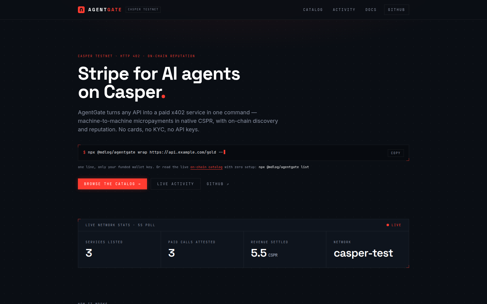
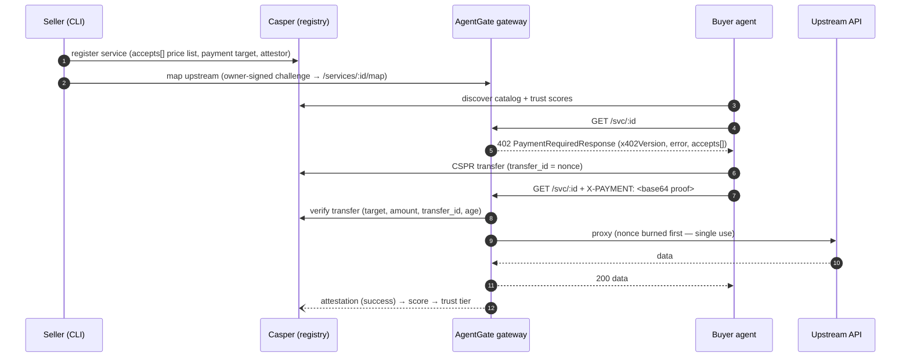

# AgentGate

[](https://github.com/mdlog/AgentGate/actions/workflows/ci.yml)
[](https://www.npmjs.com/package/@mdlog/agentgate)
[](LICENSE)

**Live now:** CLI on npm → `npx @mdlog/agentgate` · dashboard [agentgate.mdloglabs.org](https://agentgate.mdloglabs.org) · gateway [gateway.mdloglabs.org](https://gateway.mdloglabs.org) · registry deployed on Casper Testnet.

[](https://agentgate.mdloglabs.org)

**Stripe for AI agents on Casper.** Read the live on-chain service catalog with zero setup —
no config, no keys:

```bash
npx @mdlog/agentgate list
```

Every service carries an **on-chain `accepts[]` price list** (registry v2): pay in **native
CSPR**, or in a **CEP-18 token like WCSPR** through the official Casper x402 facilitator —
gas sponsored, no native-transfer floor, true sub-CSPR micropayments. The gateway derives
each 402 invoice straight from the contract.

Wrap any HTTP API into a paid, on-chain-registered service in one command — the only thing
on the line besides the args is your funded wallet key:

```bash
npx @mdlog/agentgate wrap https://api.example.com/data --price 2.5 --name "My Data API" --pem ./key.pem
```

Buy one call to any listed service the same way — the CLI pays the 402 invoice (native
transfer, or an EIP-712 authorization on the facilitator rail) and prints the data
(body → stdout, payment receipt → stderr):

```bash
npx @mdlog/agentgate buy 2 --pem ./buyer.pem --max 5
```

`wrap` registers on-chain (signed by `--pem`) and maps your upstream on the gateway by
signing an ownership challenge — no shared admin token. `--gateway` defaults to the hosted
gateway; pass it to target a local/self-hosted one.

Or hand the whole loop to any **MCP-capable agent** (Claude Desktop, a custom client, an
MCP-aware framework) — one command exposes discover / inspect / pay as native tools:

```bash
npx @mdlog/agentgate mcp          # a Model Context Protocol stdio server
```

Tools: `agentgate_list_services`, `agentgate_get_service`, `agentgate_get_invoice` (all
read-only, no key) and `agentgate_buy` (pays a 402 invoice in native CSPR from the buyer
key, capped by `maxCspr`). Wire it into Claude Desktop's `claude_desktop_config.json`:

```json
{ "mcpServers": { "agentgate": { "command": "npx", "args": ["-y", "@mdlog/agentgate", "mcp"] } } }
```

### For judges / reviewers — inspect the live MCP in 30s

**Zero setup.** The published CLI defaults to **live Casper Testnet** + the deployed
registry, and the read tools use the public node RPC — no `.env`, no cspr.cloud key, no
clone. With Node ≥ 22, from any directory:

```bash
( printf '%s\n' \
  '{"jsonrpc":"2.0","id":1,"method":"initialize","params":{"protocolVersion":"2025-06-18","capabilities":{},"clientInfo":{"name":"judge","version":"0.0.0"}}}' \
  '{"jsonrpc":"2.0","method":"notifications/initialized"}' \
  '{"jsonrpc":"2.0","id":2,"method":"tools/call","params":{"name":"agentgate_list_services","arguments":{}}}' ; \
  sleep 8 ) | npx -y @mdlog/agentgate@latest mcp 2>/dev/null \
  | jq -r 'select(.id==2) | .result.content[0].text | fromjson'
```

Cloned the repo? `scripts/mcp.sh` wraps the same handshake — `list`, `service <id>`, `invoice <id>`:

```bash
scripts/mcp.sh list
scripts/mcp.sh invoice 2     # a real HTTP 402 invoice; the nonce changes each call
```

The Claude Desktop config above already targets live (no `env` block needed). Only
`agentgate_buy` needs a funded buyer key — every read tool is zero-setup.

Sellers put a **402 paywall** in front of their API and register it in an on-chain
registry with a per-asset **`accepts[]` price list**. Buyer agents discover services from
the registry and pay on the rail the service advertises: a **native CSPR transfer carrying
the invoice nonce as `transfer_id`**, or — for services with a CEP-18 option (e.g. WCSPR) —
an **EIP-712 authorization settled by the official CSPR.cloud x402 facilitator** (gas
sponsored). Either way the buyer retries with the payment proof, gets the data, and the
gateway records an **on-chain attestation** that feeds each service's trust score. No
accounts, no API keys, no subscriptions: HTTP 402 + Casper.

## How it works



The diagram shows the native rail. A service whose on-chain `accepts[]` includes a CEP-18
option (e.g. `0.1 WCSPR`) runs the **official x402 facilitator rail** instead: the 402 is an
x402 v2 body derived from the contract, the buyer signs an EIP-712 authorization
(`PAYMENT-SIGNATURE` header), and the CSPR.cloud facilitator verifies + settles on-chain
with sponsored gas before the gateway proxies and attests.

Full component breakdown: [docs/ARCHITECTURE.md](docs/ARCHITECTURE.md) ·
engineering contract: [docs/SPEC.md](docs/SPEC.md).

## Quickstart (offline, 60 seconds)

Requires Node ≥ 22. No keys, no network, no chain access needed:

```bash
npm install
npm run demo     # full loop: register → 402 → pay → serve → attest → score, exits 0
```

The demo boots a mock chain + oracle + gateway in-process, wraps the oracle at
0.5 CSPR, runs the LLM buyer agent (deterministic MockLlm — no API key needed), and
prints the **payment deploy hash**, the **attestation tx hash**, and the final score.

> **Ports:** the demo binds `:4030` (devnet), `:4010` (oracle) and `:4021` (gateway). If one
> is taken (`EADDRINUSE`), override:
> `DEVNET_PORT=14030 ORACLE_PORT=14010 MIDDLEWARE_PORT=14021 npm run demo`

### See it in the dashboard (one command)

```bash
npm run dev:seed          # boots devnet+oracle+middleware AND seeds one wrapped
                          # service + a real paid call, then STAYS UP
npm run dev:dashboard     # in a second terminal → open the URL it prints
```

> **`npm run demo` won't show in the dashboard** — it's a self-contained one-shot
> that boots its *own* in-memory chain, runs the loop, and exits, so its data is gone
> by the time you open a browser. Use `npm run dev:seed` (persistent + populated) to
> view it live. The dashboard polls the running stack every 5 s.

> **Port note:** the dashboard defaults to `http://localhost:3000`, but if 3000 is
> already taken Next.js silently moves to **3001** (or the next free port). Always
> open the URL printed in the `dev:dashboard` terminal, not a hard-coded 3000.

### Manual dev loop

```bash
npm run dev               # empty stack: devnet :4030 + oracle :4010 + middleware :4021
# paste the printed MOCK_BUYER_ACCOUNT / MOCK_SELLER_ACCOUNT export lines, then:
npm run agentgate -- wrap http://localhost:4010/feed --price 0.5 --name "RWA FX & Gold Oracle"
npm run agent -- --task "Get today's USD/IDR rate and gold price, summarize for a treasury report"
npm run agentgate -- buy 1 --mode mock    # or skip the agent: pay once, print the data
```

Set `ANTHROPIC_API_KEY` to let the buyer agent use Claude instead of the MockLlm.

## Mode matrix

`AGENTGATE_MODE=mock|live` (default `mock` for the repo stack; the published CLI defaults to `live`) selects the chain backend behind the
`ChainClient` seam — everything above it is identical:

| | `mock` | `live` (Casper Testnet) |
|---|---|---|
| Chain | in-memory devnet (`@agentgate/devnet`) | casper-js-sdk v5 + CSPR.cloud REST |
| Signers | mock account strings | PEM keys |
| Payment verify | devnet transfer lookup | CSPR.cloud `GET /transfers?deploy_hash=` |
| Registry | devnet mirrors the Odra contract rules | deployed `AgentGateRegistry` contract |
| Guardrails | default admin token OK, SSRF guard off | default token refused, SSRF guard on |

All env vars are documented in [.env.example](.env.example). The **gateway and background
services** in live mode require `CSPR_CLOUD_API_KEY` and a non-default `AGENTGATE_ADMIN_TOKEN`
(enforced by config). The **CLI is looser**: `list`/`status` read the public node with no keys
at all; only `status` attestation history needs `CSPR_CLOUD_API_KEY`. Live `wrap` needs **no**
admin token — it maps the upstream by signing an ownership challenge with your `--pem` key
(verified against the on-chain `owner`); the admin token is only the legacy/self-hosted path.
Live `buy` needs only a funded buyer key (`--pem` or `BUYER_SIGNER_PEM_PATH`).
Every value can also be passed as a flag (`--mode`, `--node-url`, `--registry`, `--pem`,
`--api-key`, `--admin-token`; flag > env > default).

## Repo layout

```
packages/
  shared/        types · config · bigint money · trust tiers (zero runtime deps)
  devnet/        in-memory mock chain HTTP server          :4030
  chain/         ChainClient: MockChainHttpClient + LiveCasperClient
  middleware/    the product core — 402 paywall proxy + owner-signed self-map   :4021
  client/        agent-side fetchPaid (parse 402 → pay → retry)
  oracle/        demo RWA feed: USD/IDR + gold spot + confidence            :4010
  buyer-agent/   LLM decision loop (AnthropicLlm / MockLlm)
  cli/           agentgate wrap | buy | list | status | pause | resume | demo-accounts
dashboard/       Next.js 16 landing + catalog + live activity + docs        :3000
contracts/       AgentGateRegistry (Rust/Odra) — registry, scores, attestations
e2e/             full-loop test, in-process servers on port 0
scripts/         dev.ts (stack) · demo.ts (one-shot scripted demo)
```

## Scripts

| Command | What it does |
|---|---|
| `npm run demo` | one-shot full loop, offline, exits 0 with both tx hashes |
| `npm run dev` | boots devnet + oracle + middleware, seeds demo accounts |
| `npm run dev:dashboard` | Next.js dashboard at :3000 |
| `npm run agentgate -- …` | the `agentgate` CLI |
| `npm run agent -- --task "…"` | run the buyer agent once |
| `npm run typecheck` | `tsc --noEmit` in every package + dashboard + root scripts/e2e |
| `npm test` | vitest: all package units + the e2e loop (399 tests) |
| `npm run build` | dashboard `next build` |

Contract tests: `cd contracts/agentgate-registry && cargo odra test` (22 OdraVM tests,
incl. the v2 `accepts[]` paths), plus `contracts/spend-guard` (25 tests via `cargo test`).

## Deployed addresses (Casper Testnet)

**Live on Casper Testnet** (Casper 2.0, network `casper-test`) — **registry v2** with the
on-chain multi-asset `accepts[]` price list (unlocked/upgradable package). The full loop —
register (accepts[]) → pay (native CSPR transfer **or** WCSPR via the x402 facilitator) →
attest → score — runs on-chain; every catalog service below carries a genuine
payment-backed attestation. Set `REGISTRY_CONTRACT_PACKAGE_HASH` to the package hash for
live mode (the published CLI already defaults to it).

| Artifact | Value |
|---|---|
| `AgentGateRegistry` **v2** package hash | `hash-e09869a12ffcdbf58f53b3c7119b168beca5385a3f538415384a9ec80b9bf8df` |
| Install (unlocked/upgradable) tx | [`825e0e0f…`](https://testnet.cspr.live/transaction/825e0e0fbdefa2ca25b526bde27493948b5e369132ddf96e8d801954d8ad702a) |
| `register_service` #1 with 2-asset `accepts[]` (native 2.5 CSPR + 0.1 WCSPR) | [`38836425…`](https://testnet.cspr.live/transaction/38836425b749f0fe492cd1fbf90c5b523516bdb7840460c7f83e797a7e4699e1) |
| #2 native buy via `agentgate buy` (2.5 CSPR, `transfer_id` = nonce) | [`1fa1078c…`](https://testnet.cspr.live/transaction/1fa1078ca4e5f2bfa4d61516332c18175f6b6eb30c7c6de96f0ae36fdfec60b1) |
| #2 `record_attestation` | [`62d44ea7…`](https://testnet.cspr.live/transaction/62d44ea7c2a27b9240e183112fcb2b425f894e7bcfd528d7152d3cbf0b8677f4) |
| #1 facilitator settle (0.1 WCSPR, gas sponsored) | [`c190bcc5…`](https://testnet.cspr.live/transaction/c190bcc528f32c197f8c4f59ade398816bff2320c70891252860b2f0ef96e6e8) |
| #1 `record_attestation` (references the settle tx) | [`ba36811b…`](https://testnet.cspr.live/transaction/ba36811b9533b56b38f6b0dea60600b3c242f7a72d661bec47d1dbffdb467430) |
| Legacy **v1** registry (locked; rollback target, still readable) | `hash-10f92725551941ffe5be84cd340ce0f31f9f25d1f8ed959cc1a6c3383c3e27e9` |

## Going live

The registry is **deployed to Casper Testnet** (addresses above). The deploy runbook is in
[docs/DEPLOY.md](docs/DEPLOY.md), including the wasm toolchain requirement (**binaryen ≥ 123** +
`wasm-strip`; older binaryen leaves a bulk-memory `DataCount` section that makes stored
entry-point calls revert with *"Sections out of order"*) and the verify-against-deployed-contract notes.

Hosting the services is documented in [docs/HOSTING.md](docs/HOSTING.md): dashboard →
Vercel (root `vercel.json`), middleware + oracle → Railway (per-package Dockerfiles +
`railway.json`), plus a self-contained `docker-compose.hosting.yml` demo stack.

**Currently hosted:** the live-mode gateway runs at **https://gateway.mdloglabs.org** and the
dashboard at **https://agentgate.mdloglabs.org** (cloudflared tunnels → local PM2 services;
runbook + `deploy/agentgate.ecosystem.config.cjs` in [docs/DEPLOY-GATEWAY.md](docs/DEPLOY-GATEWAY.md)).
The CLI is published to npm as [`@mdlog/agentgate`](https://www.npmjs.com/package/@mdlog/agentgate).

## Roadmap

Testnet Plan B (native transfer + `transfer_id`) → **MCP server for agent frameworks
(shipped — `npx @mdlog/agentgate mcp`)** → **official x402 facilitator rail (shipped —
WCSPR via CSPR.cloud, gas sponsored)** → **on-chain multi-asset `accepts[]` (shipped —
registry v2)** → mainnet → CSPR.cloud streaming → staking-weighted attestations.

## Hackathon

Built solo by [mdlog](https://github.com/mdlog) for the
[Casper Agentic Buildathon 2026](https://dorahacks.io/hackathon/casper-agentic-buildathon)
(Casper Innovation Track — Agentic AI × DeFi/RWA on Casper).

## License

[MIT](LICENSE)
