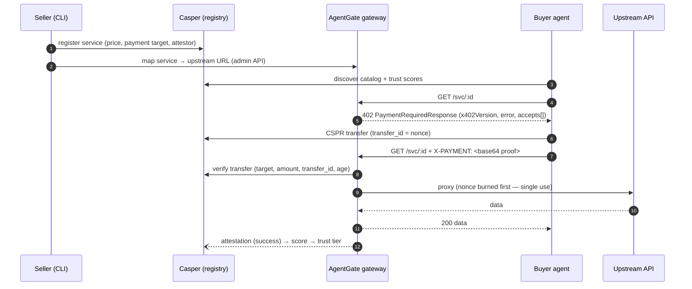

# AgentGate

**Stripe for AI agents on Casper.** Wrap any HTTP API into a paid, on-chain-registered
service in one command:

```bash
npx agentgate wrap https://api.example.com/data --price 0.5 --name "My Data API"
```

Sellers put a **402 paywall** in front of their API and register it in an on-chain
registry. Buyer agents discover services from the registry, pay with a **native CSPR
transfer carrying the invoice nonce as `transfer_id`**, retry with the payment proof, and
get the data — while the gateway records an **on-chain attestation** that feeds each
service's trust score. No accounts, no API keys, no subscriptions: HTTP 402 + Casper.

## How it works



Full component breakdown: [docs/ARCHITECTURE.md](docs/ARCHITECTURE.md) ·
engineering contract: [docs/SPEC.md](docs/SPEC.md).

## Quickstart (offline, 60 seconds)

Requires Node ≥ 22. No keys, no network, no chain access needed:

```bash
npm install
npm run demo     # full loop: register → 402 → pay → serve → attest → score, exits 0
```

The demo boots a mock chain + oracle + gateway in-process, wraps the oracle at
0.5 CSPR, runs the LLM buyer agent (deterministic MockLlm — no API key needed), and
prints the **payment deploy hash**, the **attestation tx hash**, and the final score.

### See it in the dashboard (one command)

```bash
npm run dev:seed          # boots devnet+oracle+middleware AND seeds one wrapped
                          # service + a real paid call, then STAYS UP
npm run dev:dashboard     # in a second terminal → open the URL it prints
```

> **`npm run demo` won't show in the dashboard** — it's a self-contained one-shot
> that boots its *own* in-memory chain, runs the loop, and exits, so its data is gone
> by the time you open a browser. Use `npm run dev:seed` (persistent + populated) to
> view it live. The dashboard polls the running stack every 5 s.

> **Port note:** the dashboard defaults to `http://localhost:3000`, but if 3000 is
> already taken Next.js silently moves to **3001** (or the next free port). Always
> open the URL printed in the `dev:dashboard` terminal, not a hard-coded 3000.

### Manual dev loop

```bash
npm run dev               # empty stack: devnet :4030 + oracle :4010 + middleware :4021
# paste the printed MOCK_BUYER_ACCOUNT / MOCK_SELLER_ACCOUNT export lines, then:
npm run agentgate -- wrap http://localhost:4010/feed --price 0.5 --name "RWA FX & Gold Oracle"
npm run agent -- --task "Get today's USD/IDR rate and gold price, summarize for a treasury report"
```

Set `ANTHROPIC_API_KEY` to let the buyer agent use Claude instead of the MockLlm.

## Mode matrix

`AGENTGATE_MODE=mock|live` (default `mock`) selects the chain backend behind the
`ChainClient` seam — everything above it is identical:

| | `mock` | `live` (Casper Testnet) |
|---|---|---|
| Chain | in-memory devnet (`@agentgate/devnet`) | casper-js-sdk v5 + CSPR.cloud REST |
| Signers | mock account strings | PEM keys |
| Payment verify | devnet transfer lookup | CSPR.cloud `GET /transfers?deploy_hash=` |
| Registry | devnet mirrors the Odra contract rules | deployed `AgentGateRegistry` contract |
| Guardrails | default admin token OK, SSRF guard off | default token refused, SSRF guard on |

All env vars are documented in [.env.example](.env.example). Live mode requires
`CSPR_CLOUD_API_KEY` and a non-default `AGENTGATE_ADMIN_TOKEN` (enforced by config).

## Repo layout

```
packages/
  shared/        types · config · bigint money · trust tiers (zero runtime deps)
  devnet/        in-memory mock chain HTTP server          :4030
  chain/         ChainClient: MockChainHttpClient + LiveCasperClient
  middleware/    the product core — 402 paywall reverse proxy + admin API   :4021
  client/        agent-side fetchPaid (parse 402 → pay → retry)
  oracle/        demo RWA feed: USD/IDR + gold spot + confidence            :4010
  buyer-agent/   LLM decision loop (AnthropicLlm / MockLlm)
  cli/           agentgate wrap | list | status | pause | resume | demo-accounts
dashboard/       Next.js 14 landing + catalog + live activity              :3000
contracts/       AgentGateRegistry (Rust/Odra) — registry, scores, attestations
e2e/             full-loop test, in-process servers on port 0
scripts/         dev.ts (stack) · demo.ts (one-shot scripted demo)
```

## Scripts

| Command | What it does |
|---|---|
| `npm run demo` | one-shot full loop, offline, exits 0 with both tx hashes |
| `npm run dev` | boots devnet + oracle + middleware, seeds demo accounts |
| `npm run dev:dashboard` | Next.js dashboard at :3000 |
| `npm run agentgate -- …` | the `agentgate` CLI |
| `npm run agent -- --task "…"` | run the buyer agent once |
| `npm run typecheck` | `tsc --noEmit` in every package + dashboard + root scripts/e2e |
| `npm test` | vitest: all package units + the e2e loop (288 tests) |
| `npm run build` | dashboard `next build` |

Contract tests: `cd contracts/agentgate-registry && cargo odra test` (20 OdraVM tests).

## Deployed addresses (Casper Testnet)

Filled in after running the deploy runbook; deployment itself is intentionally out of
scope for this build. Once deployed, set `REGISTRY_CONTRACT_PACKAGE_HASH` in `.env`.

| Artifact | Value |
|---|---|
| `AgentGateRegistry` package hash | _TBD — `hash-…` after deploy_ |
| Example `register_service` tx | _TBD — link to `testnet.cspr.live/deploy/…`_ |
| Example payment transfer tx | _TBD_ |
| Example `record_attestation` tx | _TBD_ |

## Going live

Deploying the registry to Casper Testnet is documented (not executed) in
[docs/DEPLOY.md](docs/DEPLOY.md): build/deploy runbook, the full list of
`NOT_DEPLOYED`-gated call paths, and the ⚠️ verify-against-deployed-contract checklist.

Hosting the services is documented in [docs/HOSTING.md](docs/HOSTING.md): dashboard →
Vercel (root `vercel.json`), middleware + oracle → Railway (per-package Dockerfiles +
`railway.json`), plus a self-contained `docker-compose.hosting.yml` demo stack.

## Roadmap

Testnet Plan B (native transfer + `transfer_id`) → mainnet → x402 Facilitator (Plan A)
→ CSPR.cloud streaming → MCP server for agent frameworks.

## License

[MIT](LICENSE)
